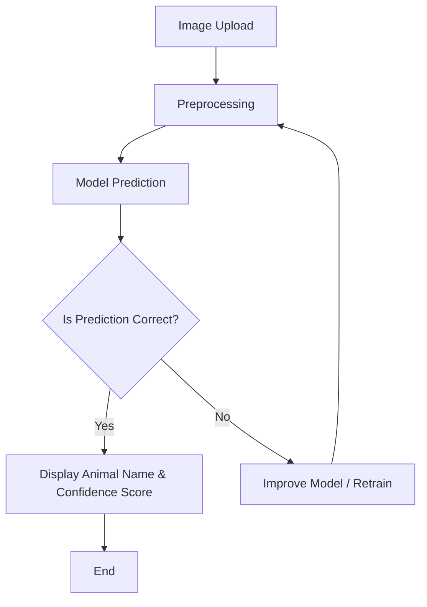

# 🐾 Animal Classifier - Identify Your Wildlife Companion! [👀](https://aritramofficial-animal-classifier.hf.space/) 
<p align="center">
  <a href="https://aritramofficial-animal-classifier.hf.space/" target="_blank">
    
  </a>
</p>

---

A robust deep learning-based image classifier that accurately predicts animal species from images using **Transfer Learning** with **MobileNetV2**. This project includes a user-friendly web interface powered by **Gradio**, allowing seamless interaction for users.  

---

## 🚀 Key Features  
✅ Classifies **15 animal species** with high accuracy.  
✅ Utilizes **MobileNetV2** for efficient transfer learning.  
✅ Provides a clean and interactive interface via **Gradio**.  
✅ Ensures improved accuracy with **data augmentation**, **dropout layers**, and **early stopping**.  
✅ Easy deployment using **Hugging Face Spaces**.  

---

## 📋 Project Flow  
Below is the structured flow of the project:  



---

## 🗂️ Dataset Information  
The dataset contains **15 classes** of animals, with images resized to **224x224x3** for compatibility with MobileNetV2.  

### **Classes in the Dataset:**  
🐻 Bear | 🐦 Bird | 🐱 Cat | 🐄 Cow | 🦌 Deer | 🐶 Dog | 🐬 Dolphin | 🐘 Elephant  
🦒 Giraffe | 🐎 Horse | 🦘 Kangaroo | 🦁 Lion | 🐼 Panda | 🐯 Tiger | 🦓 Zebra  

``` Unzip the 'dataset' after downloading it on your local machine.  ```

---

## 🏗️ Tech Stack  
- **Python**  
- **TensorFlow/Keras** (For Model Training)  
- **Gradio** (For Web Interface)  
- **Hugging Face Spaces** (For Deployment)  

### **🔎 Why Use MobileNetV2 in This Project?**  

- 🚀 **Fast Training:** Achieved good performance with just **20 epochs**, reducing training time significantly.  
- 🎯 **High Accuracy:** Delivered an impressive accuracy of approximately **85%** with minimal hyperparameter tuning.  
- 🔄 **Transfer Learning Support:** Leveraged pretrained MobileNetV2 on **ImageNet** for improved feature extraction and faster convergence.  
- 📱 **Optimized for Edge Devices:** Designed for efficient inference on mobile phones, IoT devices, and other resource-constrained platforms.  
- ⚙️ **Lightweight Architecture:** Uses fewer parameters and employs **Depthwise Separable Convolutions**, ensuring reduced computational cost without compromising performance.
---

## ⚙️ Installation and Setup  
### 1️⃣ **Clone the Repository**
```bash
git clone https://github.com/AritraOfficial/Animal-Classifier.git
cd Animal-Classifier
```

### 2️⃣ **Install Dependencies**  
Create a `requirements.txt` file with the following content:  
```
tensorflow
gradio
pillow
```

Then run:  
```bash
pip install -r requirements.txt
```

### 3️⃣ **Download the Model**  
Ensure the model file **`animal_classifier_model.h5`** is in the project directory.

---

## 🚀 Running the Application  
To run the Gradio interface locally:  
```bash
python app.py
```

The application will run on **`http://localhost:7860`** or a provided Gradio link.  

---

## 🧪 How to Use the Application  
1. Click the **“Upload Image”** button in the web interface.  
2. Select an image containing one of the 15 animal classes.  
3. The app will display the **Predicted Animal** along with its **Confidence Score**.  

---

## 📊 Results and Evaluation  
- Achieved **~94% accuracy** after 15 epochs.  
- Utilized **EarlyStopping** and **Learning Rate Scheduling** to improve convergence.  
- Applied **Data Augmentation** to improve model generalization.  

---

## 📈 Visualizations  
The model's performance can be analyzed through these plots:  

- **Training vs Validation Accuracy**  
- **Training vs Validation Loss**  

(Include visualization plots if needed.)

---

## 🌍 Deployment on Hugging Face Spaces  
This project is deployed on **Hugging Face Spaces** for easy access.  
<p align="left">
  <a href="https://aritramofficial-animal-classifier.hf.space/" target="_blank">
    
  </a>
</p>

---

## 🛠️ Future Improvements  
✅ Improve model accuracy with more epochs or fine-tuning.  
✅ Add more animal classes for enhanced versatility.  
✅ Introduce features like **bounding boxes** for object localization.  

---

 

## ✒️ Author 
[``` Aritra Mukherjee ```](https://github.com/AritraOfficial)

---
## 🤝 Contribution Guidelines 
Contributions are welcome! If you'd like to improve the project:  
1. Fork the repository.  
2. Create a feature branch (`git checkout -b feature-name`).  
3. Commit your changes (`git commit -m "Add feature"`).  
4. Push the branch (`git push origin feature-name`).  
5. Create a Pull Request.  

---

## 📜 License  
This project is licensed under the **MIT License**.  

---

## 🙌 Acknowledgments  
Special thanks to the creators of **TensorFlow**, **Gradio**, and **Hugging Face Spaces** for their powerful tools that made this project possible.  

---

## 📧 Contact 
For queries or collaborations, feel free to connect:  
<p align="center">
  <a href="https://www.linkedin.com/in/aritramukherjeeofficial/" target="_blank">
    
  </a>
  <a href="https://x.com/AritraMofficial" target="_blank">
    
  </a>
  <a href="https://www.instagram.com/aritramukherjee_official/?__pwa=1" target="_blank">
    
  </a>
  <a href="https://leetcode.com/u/aritram_official/" target="_blank">
    
  </a>
  <a href="https://github.com/AritraOfficial" target="_blank">
    
  </a>
  <a href="https://discord.com/channels/@me" target="_blank">
    
  </a>
  <a href="mailto:aritra.work.official@gmail.com" target="_blank">
    
  </a>
</p>

---

### 🚀 **Ready to classify animals like a pro? Dive in and give it a try! Give a love and star on the project.** 🐾
